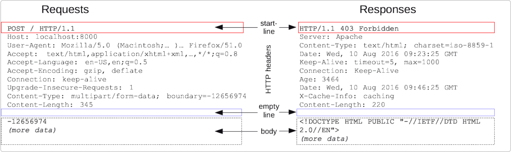

# HTTP (Hypertext Transfer Protocol)
## 학습 키워드
---
- HTTP(Hypertext Transfer Protocol)
- HTTP와 HTTPS의 차이(TLS)
- 클라이언트-서버 모델
- stateless와 stateful
- HTTP Cookie와 HTTP Session
- HTTP 메시지 구조
    - HTTP 요청(Request)와 응답(Response)
        - multipart/form-data
    - HTTP 요청 메서드(HTTP request methods)
        - 멱등성
    - HTTP 응답 상태 코드(HTTP response status code)
        - 리다이렉션

## HTTP 정의
--- 
hypertext는 초월 텍스트라는 의미로, HTTP란 텍스트뿐 아니라 그림, 동영상 등을 포함하는 전송 프로토콜 이라고 직역해볼 수 있겠다.   

즉, ***HTML와 같은 문서를 전송하기위한 Application Layer에서 사용하는 규칙을 정의한 것.**

> HTML (Hyper Text Markup Language) : 초월 텍스트로 된 마크업 언어 -> 간단히 해석하면 웹페이지 언어

* HOW?  어떻게 주고 받는가.  
Request (요청) : 서버 <- 클라이언트(브라우저)  
Response (응답) : 서버 -> 클라이언트(브라우저)

* WHAT?  무엇을 주고 받는가.  
프로토콜을 구성하는 하위 문서들  
ex. 텍스트, 레이아웃 설명, 이미지, 비디오, 스크립트

## HTTP와 HTTPS의 차이(TLS)
---
TLS (Transport Layer Security) : 전송하고자 하는 것에 암호화를 더하여 기밀성을 보장하고자 할때 사용되는 기술

HTTPS (HTTP Secure) : TLS을 거친 HTTP.

따라서 **HTTP / HTTPS의 차이점은 보안계층인 TLS (혹은 SSL) 를 거쳤느냐 거치지 않았느냐** 이다.

 

(HTTP의 큰그림 (Architecture) - 출처. [mdn web docs](https://developer.mozilla.org/ko/docs/Web/HTTP/Overview))    

## 클라이언트-서버 모델
---
* 2-tier Architecture   
구조 : **클라이언트 <-> 서버**   
의미 : 리소스를 사용하는 클라이언트와 리소스를 제공하는 서버를 분리시키는 모델을 뜻한다.

* 3-tier Architecture   
구조 : **클라이언트 <-> 서버 <-> DB**   
의미 : 서버가 DB에 리소스를 저장하는 구조로, 서버는 리소스를 전달하는 역할만 한다. 대부분 요 구조.

> 브라우저 : 클라이언트가 이용하는 도구. 브라우저를 통해 클라이언트가 서버에게 데이터를 요청하고, 서버가 클라이언트에게 데이터를 제공한다.

## Stateless와 Stateful
---
### 1) Stateful   
클라이언트의 상태 정보를 서버에서 저장함으로써 클라이언트와 서버간의 통신을 유지하는 것       
즉, 상태관리의 주체는 서버

**How?**   
브라우저의 쿠키(Cookie)에 저장되거나, 서버의 세션(Session) 메모리에 저장

### 2) Stateless
클라이언트의 상태 정보를 서버에서 자장하지 않고, 단순히 요청에 대한 응답만 보내게 됨.   
즉, 상태관리의 주체는 클라이언트

## HTTP Cookie와 HTTP Session
--- 
## 1) HTTP Cookie
* What?   
클라이언트의 키, 값, 유효시간, 도메인, 경로
* Where?   
브라우저
* How?   
Request시에 브라우저가 자동으로 Request Header를 넣어서 서버에 전송   
* Why?   
Stateless한 HTTP의 약점을 보완하기 위하여 -> 쿠키를 사용함으로써 Stateful 할 수 있음.   

* 동작 방식    
클라이언트가 페이지를 요청 -> 서버에서 쿠키를 생성 -> 헤더에 쿠키를 포함시켜 응답 -> 브라우저가 종료돼도 만료 기간 내이면 클라이언트가 보관 -> 같은 요청시 서버에서 쿠키를 읽어, 쿠키 업데이트하여 변경된 내용을 HTTP 헤더에 포함시켜 응답

* 예시   
자동 로그인 등 

## 2) HTTP Session
: 쿠키 기반, BUT 서버에서 관리. 서버에 쿠키와 세션 id를 함께 전달하여 서버에서 관리하도록 함.

* 장점   
서버에 자원을 저장하기 때문에 더 보안이 우수함  
* 단점    
속도가 쿠기가 더 빠름, 서버의 자원을 요구함.      

> 캐시 : 서버의 응답 (s->c) 들을 일시적으로 저장하는 곳 (장점 - 요청들에 리소스를 재활용 할 수 있음, 단점 - 서버에 변경이 있어도 사용자는 모를 수 있음)       
>    
> 프록시 : c <-> s 사이에 수많은 머신이 http 메시지를 전달하는데, 이 중 app layer에서 동작하는 머신을 일컫음.    
 캐시의 역할을 수행하며, 아래와 같이 c <-> s 통신 과정에 proxy가 껴서 캐시 역할을 한다.
> 

## HTTP 구조
--- 
### 1) 메시지 구조

(요청과 응답은 모두 구조가 동일하다.)

* Start line 
* Headers
* 빈 줄 (메타 정보가 전송되었음을 알려주는 black line)
* Body    

### 2)  Method
* GET : read 할 때
* HEAD : *캐시가 만료됐는지 / 접근 가능한지 등을 확인하고 싶을 때 (멱등성 보장 — 변경이 없음)
* POST : 데이터를 전송 (멱등성 x)
* PUT : update 혹은 create → overwrite
* PATCH : update (partial)
* DELETE

### 3) Status Code
- 1xx : 정보
- 2xx : 성공
- 3xx : 리다이렉션
- 4xx : 클라이언트 쪽 문제
- 5xx : 서버 쪽 문제
