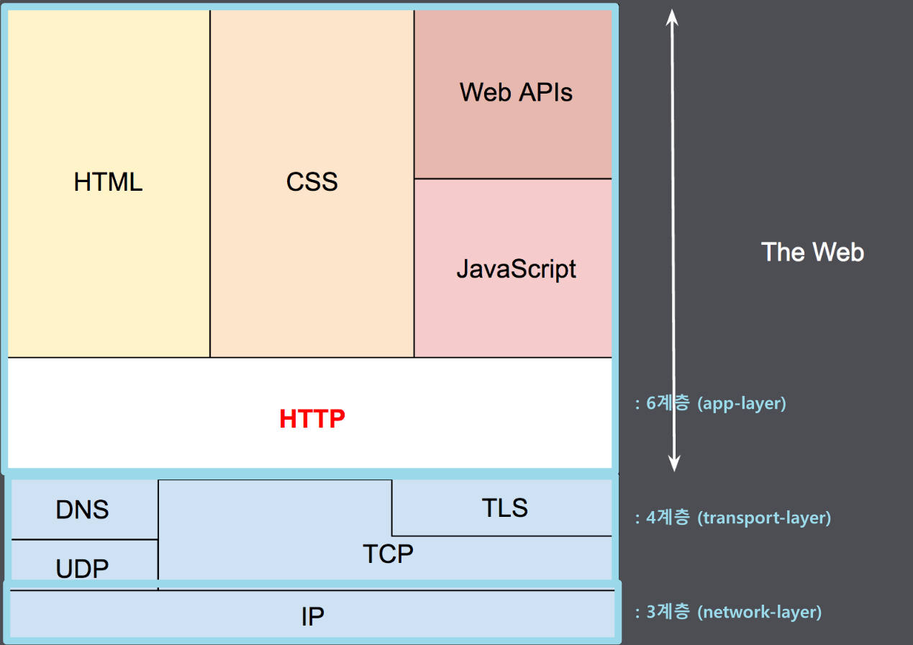
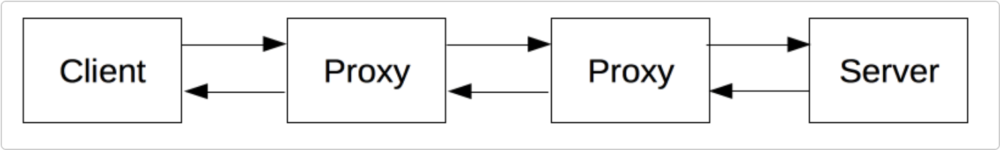

# HTTP (Hypertext Transfer Protocol) 란?

## 내맘대로 정의
--- 
hypertext는 초월 텍스트라는 의미로, HTTP란 텍스트뿐 아니라 그림, 동영상 등을 포함하는 전송 프로토콜 이라고 직역해볼 수 있겠다.   

즉, *HTML를 전송할 때 사용하는 규칙을 정의한 것. 

아래 HTML의 의미를 생각하면 더 간단히 말해서 웹페이지를 표시하도록 구성요소를 주고받는 프로토콜이다.

> HTML (Hyper Text Markup Language) : 초월 텍스트로 된 마크업 언어 -> 간단히 해석하면 웹페이지 언어

* HOW?  어떻게 주고 받는가.  
Request (요청) : 서버 <- 클라이언트(브라우저)  
Response (응답) : 서버 -> 클라이언트(브라우저)

* WHAT?  무엇을 주고 받는가.  
프로토콜을 구성하는 하위 문서들  
ex. 텍스트, 레이아웃 설명, 이미지, 비디오, 스크립트

## HTTP의 큰그림 (Architecture)
--- 

(출처. [mdn web docs](https://developer.mozilla.org/ko/docs/Web/HTTP/Overview))    

* IP   
IP address를 이용하여 기기간 식별을 할 수 있음

* TCP / UDP   
전송 프로토콜 중 대표적인 녀석들로, 포트 번호를 통해 기기 내 통신이 가능하도록 함.

* HTTP

> TLS (Transport Layer Security) : 전송하고자 하는 것에 암호화를 더하여 기밀성을 보장하고자 할때 사용되는 암호화 프로토콜 (= SSL (Secure Sockets Layer))    
HTTPS (HTTP Secure) : TLS을 거친 HTTP

## HTTP 특징
--- 
디테일한 특징에 대해서 알아보자.

* HTTP는 각각의 요청이 독립적   
    * 쿠키
    * 세션 Key (대게 쿠키로 관리) by 서버
    * localStorage by 클라이언트

## HTTP 구조
--- 
### 1) 메시지 구조

(요청과 응답은 모두 구조가 동일하다.)

* Start line 
* Headers
* 빈 줄 (메타 정보가 전송되었음을 알려주는 black line)
* Body    

### 2)  Method
* GET : read 할 때
* HEAD : *캐시가 만료됐는지 / 접근 가능한지 등을 확인하고 싶을 때 (멱등성 보장 — 변경이 없음)
* POST : 데이터를 전송 (멱등성 x)
* PUT : update 혹은 create → overwrite
* PATCH : update (partial)
* DELETE

### 3) Status Code
- 1xx : 정보
- 2xx : 성공
- 3xx : 리다이렉션
- 4xx : 클라이언트 쪽 문제
- 5xx : 서버 쪽 문제

> 캐시 : 서버의 응답 (s->c) 들을 일시적으로 저장하는 곳 (장점 - 요청들에 리소스를 재활용 할 수 있음)       
>    
> 프록시 : c <-> s 사이에 수많은 머신이 http 메시지를 전달하는데, 이 중 app layer에서 동작하는 머신을 일컫음.    
 캐시의 역할을 수행하며, 아래와 같이 c <-> s 통신 과정에 proxy가 껴서 캐시 역할을 한다.
> 