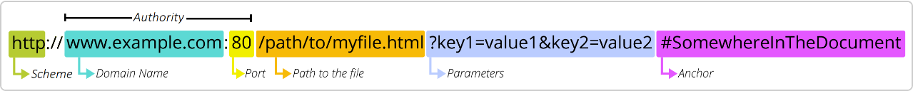
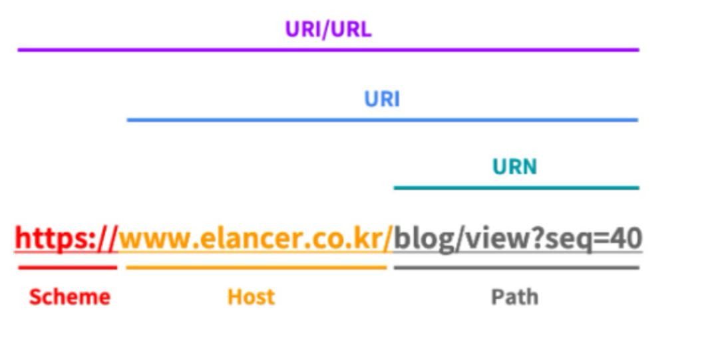

# 1-2. HTTP Client


## TCP / IP 통신
---
TCP (Transfer Control Protocol) / IP (Internet Protocol)

3-Layer 와 4-Layer을 합쳐서 일컫는 말.

## TCP와 UDP
--- 
전송 계층의 대표적인 프로토콜
* TCP : S<->C간 연결 후 데이터 전달 
* UDP : 일방적으로 데이터 전달

      
## Socket과 Socket API
--- 
위 프로토콜은 Socket으로 데이터를 받음으로써 전달이 될수있고,Socket API를 통해 구현할 수 있다.

* Socket : 프로세스 간 통신의 종착점   
* Socket API : 통신에 대한 프로그래밍 하기 위해 사용하는 것


## URI와 URL
--- 


* URI (Uniform Resource Identifier)   
: Uniform (통일된) + Resource (리소스의) + Identifier (구별 정보)
즉, 리소스를 구별하기 위한 통일된 방식의 고유 식별자 (식별자)

* URL (Uniform Resource Locator)   
: Uniform (통일된) + Resource (리소스의) + Locator (주소)  
즉, URL은 URI에 프로토콜을 포함시켜 위치를 나타낸 것 (주소체계)

*  URN (Uniform Resource Name)
: 웹의 위치와 상관없이 리소스의 이름을 나타낸 것. (이름)

> url의 역사   
> 1994년 World Wide Web의 창시자인 Tim Berners-Lee에 의해 탄생. ->   
> 2002년 최초의 URL 단축 서비스인 TinyURL을 만듦 (현재는 Bitly) -> *나중에 원리 공부해보기*


* Host : 통신을 할 수 있는 네트워크에 연결된 기기 (장비)

* IP (Internet Protocol) 주소 : 인터넷 프로토콜을 사용하는 네트워크에 연결된 모든 장치에 할당된 번호
(표현 체계 : IPv4/IPv6)

* Domain Name : 서버를 읽을 수 있는 주소로 제공
    - DNS (Domain Name System) : DNS에 의해 IP주소를 도메인 이름으로 변환. 라우팅 정보를 제공하는 분산형 데이터 베이스 시스템

* Port : Host가 외부와 통신을 하기위한 통로. 각 포트는 프로세스 / 서비스와 연결 됨.


## Java 문법
---

* Java text blocks   

    * 기본 구조
    ```
    /* 1-1. Okay -- 가장 일반적인 형태 */
    String example = """
            Hello World
            """;

    /* 1-2. Error -- """ 후 띄우지않고 문자가 나오면 에러  */
    String example = """ Hello
                    World
                    """;

    /* 2-1. Okay -- 1-1과 동일한 형태 */
    String example = "Hello" +
                    " " +
                    "World";
    ```

    * Incidental White Space (부수적인 공백)
    ```
    void writeHTML() {
        String html = """
    ········<html>
    ········    <body>
    ········        <p>Hello World.</p>
    ········    </body>
    ········</html>
    ········""";
        writeOutput(html);
    }
    }
    ```
    가장 적은 줄의 공백을 기준으로 공백을 제거하여 읽음.
- Java InputStream과 OutputStream
    * Output
    ```
    /* 1. OutputSream 그대로 보내기 */
    OutputStream outputStream = socket.getOutputStream();
    outputStream.write(message.getBytes());
    ```
    OutputStream은 ByteArray로만 보낼 수 있음 -> message를 ByteArray로 변환하여 보내기

    ```
    /* 2. OutputSreamWriter */
    OutputStream outputStream = socket.getOutputStream();
    Writer writer = new OutputStreamWriter(outputStream);

    writer.write(message);
    writer.flush();
    ```
    OutputStreamWriter를 사용하기 위해서는 인자로 outputStream를 넣어주어야 함.


    Writer는 추상화 클래스이고, 문자 기반 출력 스트림의 최상위 클래스이다. 
    OutputStreamWriter 클래스 선언할때 Writer의 상속을 받는 형태이기 때문에 Writer로 받아와도 됨. -> *사실 왜 이렇게 쓰는지, OutputStreamWriter로 받을때랑 어떤 차이가 있는지 와닿지 않는다. 이 부분 공부 필요*
    
    위 방식이 Buffer가 존재하여, 사용하기 편함

    추가로, 버퍼의 크기를 초과하지 않는한 데이터가 써지지않으므로, flush 해주어야함

    * Input
   ```
    1. InputStream
    InputStream inputStream = socket.getInputStream();
    byte[] bytes = new byte[1_000_000];
    int size = inputStream.read(bytes);

    byte[] data = Arrays.copyOf(bytes, size);   /* 사이즈만큼 자르기 */
    String text = new String(data);             /* string으로 변환  */
    ```
    InputStream도 마찬가지로 byteArray로 입력을 받는다. 따라서 임의의 큰배열을 만들어주고, inputStream으로 읽어온다. 이후 사이즈만큼 잘라주고 String으로 변환해준다.

    ```
    2. InputStreamReader
    InputStream inputStream = socket.getInputStream();
    Reader reader = new InputStreamReader(inputStream);
    CharBuffer charBuffer = CharBuffer.allocate(1_000_000);

    reader.read(charBuffer);
    charBuffer.flip();
    String text = charBuffer.toString();
    ```
    reader가 자동으로 크기만큼 잘라주므로, 이방식을 사용할 경우 다시 자를 필요가 없다. 다만, charBuffer로 할당하는 과정에서 문자가 뒤집혀 들어가므로 flip 과정이 필요함


- Java try-with-resources   
try 구문에 리소스를 선언하고, try 코드 블락이 끝나면 자동으로 리소스를 반납(close)해주는 기능.
    ```
    try(Socket socket = new Socket("example.com", 80)) {
        ...
    }
    ```
    따라서 위와 같이 사용하면, close 메서드를 명시할 필요가 없고, try 블록이 완료되면 자동으로 close 메서드 호출이 됨.

    ** 참고! try문 없이 close문 메서드를 명시하지 않아도, GC가 자동으로 제거해준다. 다만, 언제 제거될지는 모름 **

* exception   
자바에서는 일어날 수 있는 에러에 대한 예외처리가 필요하다. 그렇지 않으면 Compile error가 발생한다. -> *예외처리 관련하여 공부하기*
