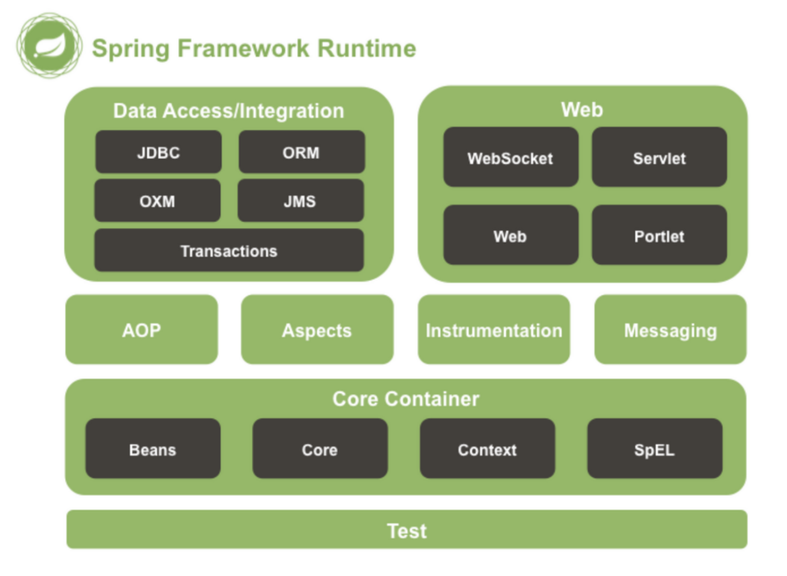

# 1-5. Spring Web MVC


### **Spring**
---
* Java 기반의 웹 프레임워크로, 웹 어플리케이션을 만들기 위한 도구.
* 관련 기술 : JSP, MyBatis, JPA 

> 라이브러리 : 단순히 기능구현을 위한 기능들을 가져다가 쓰는 것    
> 프레임워크 : 기능 구현 외에도 설계도 틀을 함께 제공   
> 구분하는 큰 차이 -> 제어의 흐름이 어디에 있는가!


스프링이 포함하고 있는 모듈들이다.   
-> *잘모르겠으니, 다음에 다시 돌아와서 보기*


### **Spring Boot**
---
기존 Spring에 톰캣 서버를 내장하여 편의 기능들을 추가한 Java 기반의 웹 프레임워크
* 어떤 편의 기능?   
Spring 애플리케이션을 구성 -> 설정 -> 배포 와 같은 기능을 돕는 녀석.
* 톰켓 이란? .html 이 아닌 언어의 코드를 .html로 번역해서 클라이언트에게 제공해주는 역할 (by 아파치 서버 - 정적 파일을 처리하는 웹서버)


### **Spring initializer**
---
Spring 프로젝트를 간단하게 생성해주는 웹도구
- Project  
Spring Boot를 빌드하고 배포하는 방식입니다. Maven, Gradle 중 선호하는 프로젝트를 선택합니다.

* Language   
개발 언어 선택

* Spring Boot   
Spring Boot의 버전을 선택

* Project Metadata   
Group : 기업의 도메인 명   
Artifact : 빌드 결과물 이름   
Name : 이름   
Description : 프로젝트 설명   
Package name : 패키지 이름   
Packaging : 배포 형태(Jar, War)   
Java : 자바 버전   

* Dependencies   
주입할 라이브러리를 선택 가능   
이후에 설정 파일(maven은 pom.xml, gradle은 build.gradle)을 통하여 직접 등록해도 무방

###

### Web Server와 Web Application Server(WAS)
---
* Web Server
HTTP 프로토콜을 기반으로 하여 클라이언트의 요청을 서비스하는 기능을 담당
    * 정적인 컨텐츠 -> 바로 리소스 제공
    * 동적인 컨텐츠 -> WAS에 요청을 보내고 결과를 클라이언트에 응답
    * 예시) 아파치 서버 등

###
* WAS (Web Application Server)  
동적인 컨텐츠를 제공하기 위해 만들어진 어플리케이션 서버 (DB 조회 등). 미들웨어 
    * 역할 : DB 접속 기능, 여러개의 트랜잭션 관리 등

### Model-View-Controller(MVC) 아키텍처 패턴
---
소프트웨어 디자인 패턴
* Model : 데이터, 로직 관리
* View : 화면 처리
* Controller : 명령을 Model <-> View 라우팅

### 관심사의 분리(Seperation of Concern)
---
관심사의 분리는 OOP 5대 설계 원칙 하나인 단일 책임 원칙(SRP, Single Responsibility Principle) 에 대한 것

하나의 모듈은 하나의 책임만 가진다는 뜻

* 위의 MVC에서 추구하는 목표

### Spring MVC
---
스프링 프레임워크 모듈 중 웹 계층에서 서블릿 API기반으로 클라이언트의 요청을 처리하는 모듈

> 서블릿 이란?   
클라이언트의 요청이 오면 기능을 수행하고 응답하는 녀석.   
동적인 기능을 제공하고, MMC에서 컨트롤러로 이용됨

최근에는
- 웹에선 Controller만으로 충분
- Controller 대신 Handler

### Java Annotation
---
* 사전의미는 주석 -> @를 이용해 주석처럼 달아 특수한 의미를 부여. 
* 프로그램에게 추가적인 정보를 제공하는 메타데이터

```
@Override
public void getInfo(){
    System.out.println("test);
}
```
위와 같이 사용할 수 있음. 메서드를 오버라이드 하겠다는 의미.

### Spring Annotation
- @RestController
    ```
    @Controller
    @ResponseBody
    public @interface RestController {
    }
    ```
    선언부를 보면, Controller와 ResponseBody를 포함하고 있음 *-> library import 하는 느낌으로 생각하면 될까나?*
    - @Controller
        * 위에서 언급된 Controller의 역할을 함.
        * 스프링 모듈 중 스프링 빈 내의 @Controller, @Service, @Repository, @Component 중 하나
        * 스프링 빈 객체로 관리하게 됨
        ###

    - @ResponseBody  
        * 요청 본문(request body)에 담긴 값을 자바객체로 변환 
    
- @GetMapping
    ```
    @RequestMapping(method = RequestMethod.GET)
    public @interface GetMapping {
    }
    ```
    HTTP GET 요청을 처리하는 메서드를 맵핑(@RequestMapping) 하는 어노테이션
    - @RequestMapping   
        * 위 코드처럼 method = GET이라고 명시되어있음.
        * http요청의 본문(body)이 그대로 전달됨

> 스프링 빈 (Bean) : 어노테이션으로 등록하면 스프링 컨테이너에 의해 관리되는 재사용 가능한 컴포넌트