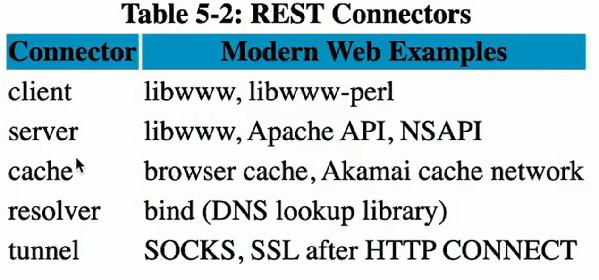

## 학습 키워드

## 1) API (Application Programming Interface)
    프로그램간 통신을 하도록 연결해주는 통로 
    --> 클라이언트 (브라우저, 모바일 앱), 서버 (DB 등) 간의 연결을 돕는 녀석.

* API 종류
    * SOAP API : XML 메시지 형식을 사용하여 HTTP / SMTP 요청 수신
        * 과거에 많이 사용
        * 장점 : 다양한 언어로 작성하여 통신 가능
        * 단점 : 유연성이 떨어짐
    ####
    * REST API : 자원의 표현에 의한 상태 전달 (xml 혹은 json 형식)
        * 장점 : HTML, XML, 일반 텍스트, JSON과 같은 다양한 형식으로 메시지를 반환할 수 있음
    ####
    * WebSocket API : JSON 객체를 사용해 전달
        * 장점 : 양방향 통신
### 
* 인터페이스 특징
    * Communication (통신)
    * Specification (명세)
    * Infomation Hiding (정보 은닉)
    * Encaptulation (캡슐화)
    * Implementation (구현)
### 
* 캡슐화 vs 정보 은닉
    * 캡슐화 : 연관있는 녀석들끼리 묶는 작업
    목적 : 중요한 데이터를 보존 / 보호 -- 외부의 잘못된 접근으로 값이 변하는 의도치 않은 동작을 방지
    ####
    * 정보 은닉 : 숨기는 것 (내부 동작을 외부에서 알수 없게 숨기고, 인터페이스를 통해서만 동작하도록 하는 것)
    목적 : 구체적인 정보를 노출시키지 않는 것
        * 객체의 구체적인 타입 은닉 ( = 업캐스팅)
        * 객체의 필드 및 메소드 은닉 ( = 캡슐화)
        * 구현 은닉 ( = 인터페이스 & 추상 클래스)
    ####
    * 즉, 정보 은닉 중 하나가 캡슐화!
###
* Architecture와 Architecture Style의 차이
    * Architecture란?
        * 웹 서버가 어떻게 작동하며, 요청을 처리하고 응답을 생성하는지에 대한 구조와 방식.
        * 확장성 / 가용성 / 성능의 관점으로 설계
    ####
    * Architecture Style란?
        * 소프트웨어 시스템의 구조과 상호 작용 방식을 설명하는 패턴이나 접근 방식.
        * 예로, Three-Tier Architecture, Microservices Architecture, Serverless Architecture 등이 있음.'
    ####
        결국, Architecture는 구조와 방식을 정의한 것이고, Architecture Style는 이러한 아키텍쳐를 패턴화한것을 말함.

## 2) REST (Representational State Transfer)
------
- web에서 App간 결합도를 낮추게 설계하는 Architecture Style

- 6가지 제약조건을 가짐

        1️⃣ Starting with the Null Style

        2️⃣ Client-Server

        3️⃣ Stateless

        4️⃣ Cache

        5️⃣ Uniform Interface

- 위 제약조건을 지킨 경우, **RESTful** 하다고 함.

### 제약 조건
* Starting with the Null Style

* Client-Server   
Client와 Server를 분리함으로써 의존성을 낮춤

* Stateless   
Server가 정보를 저장하는 것이 아닌, 매번 클라이언트에서 서버로의 각 요청에 정보가 포함되어야 함.

* Cache   
요청에 대한 응답의 데이터에 해당 요청이 캐시 가능한지 여부를 명시해야함 --> 가능하다면 동일 요청이 왔을때 재사용할 수 있어야함

* Uniform Interface   
구성요소 사이의 인터페이스가 균일해야 함

* Layered System   
계층으로 구성이 가능해야하며, 각 레이어에 속한 구성요소는 인접하지 않은 레이어의 구성요소를 볼 수 없어야 함

* Code-On-Demand (Optional)   
Code-On-Demand가 가능해야 하며, 서버가 네트워크를 통해 클라이언트에 프로그램을 전달하면 그 프로그램이 클라이언트에서 실행 될 수 있어야함. (not 필수)