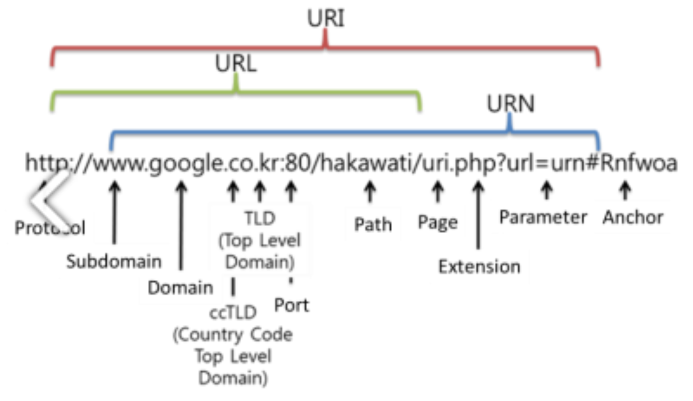

## 학습 키워드
- URI & URL & URN
- MIME type
###
## 1) URI & URL & URN
   

####
### URI (Uniform Resource Identifier)
* 리소스를 식별 방식
* URL과 URN을 포함하는 상위개념   
*-> 주소든 이름이든 하나의 리소스를 가리키고 있다면 URI라고 볼수 있다*
.
* 다만, URI와 URL을 보통 동의어로 사용
####
### URL (Uniform Resource Locator)
* 리소스의 위치를 가리키는 문자열
* HTTP 맥락에서 URL은 웹주소 혹은 링크
####
### URN (Uniform Resource Name)
* 리소스의 유니크한 이름
* 거의 사용하지 않음
####
## 2) MIME Type
### MIME (Multipurpose Internet Mail Extensions)
* 네트워크를 통해 데이터를 전송할때, 통일된 전송 체계에 맞추기 위한 변환 메커니즘

### MIME Type (Content Type)
* 클라이언트에게 전송된 문서의 종류를 알려주기 위한 메커니즘 (확장자를 전달하지 않기 때문에 -- 가능은 하나, 잘사용x)
* 변환전의 타입을 "Content-Type" 정보에 담아 보냄
* 종류   
        일반적인 구조)
        type/subtype

        1) text
        text/plain -> email
        text/html -> 일반적 웹문서
        text/css

        2) image
        : gif 같은 이미지도 포함
        image/jpeg 
        image/png
        
        3) audio
        audio/mpeg
        audio/ogg

        4) video
        video/mp4

        5) application
        : binary-데이터
        application/xml -> 범용적, 서술하기 어려움
        application/json -> 범용적, 서술하기 굉장히 어려움
* 참고   
대소문자를 구분하지는 않지만 전통적으로 소문자를 사용