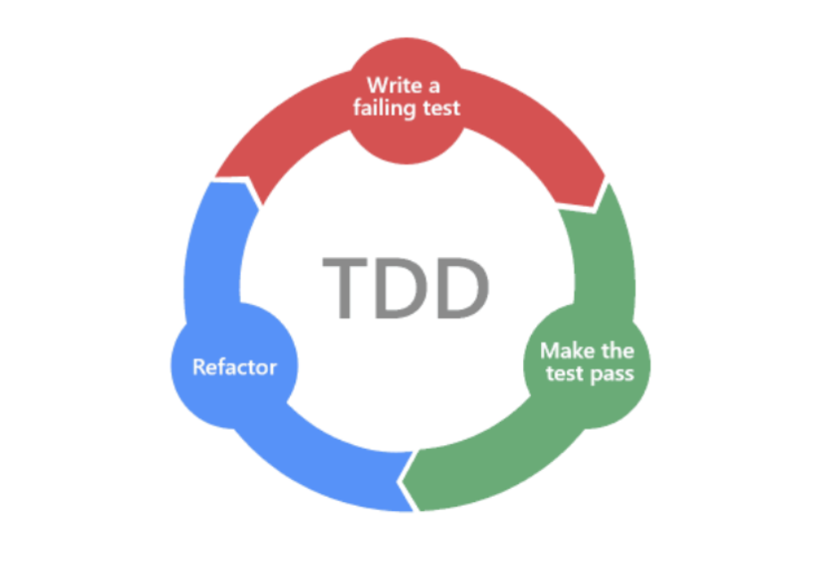

## 학습 키워드
- Domain Model 이란
- Repository
- VO(Value Object)

## 4-Layer Architecture

* UI
* Application   
	* 역할 : 수행할 작업을 정의하고, 도메인 객체가 문제를 해결하게 함.
	* 참고 : 이 계층은 얇게 유지해야함
* Domain   
	* 역할 : 업무 규칙, 업무 사황에 대한 정보를 책임짐. 상태 저장과 같은 세부사항은 인프라스트럭처에 위임.
	* 이녀석이 핵심!
* Infrastructure   
	* 참고 : 상위 계층을 지원

## Domain
* 정의 : 비즈니스 로직을 수행하는 객체
- Domain Model 이란   
	도메인에 대한 지식을 선택적으로 단순화하고 의식적으로 구조화한 형태   
	행위가 중요!
	

## Repository   
* 영구 저장소가 아닌, 객체의 상태를 관리하는 저장소
* 비교
	* DAO : 데이터 관리 (DB중심)
	* Repository : 도메인 모델 관리 (도메인 모델 중심)

## VO(Value Object)
* dto 패키지
* 불변 클래스로, Read-Only 속성만을 가지고 있음 (getter 성격의 메서드민 사용)

## 참고
* 과거 방식 : ERD 먼저 그리기 -> DAO + VO == 데이터베이스 주도 개발
* 최근 트렌드 (DDD) : 도메인 먼저 만듦 -> JPA Entity를 만듦 -> 도메인 모델과 매핑