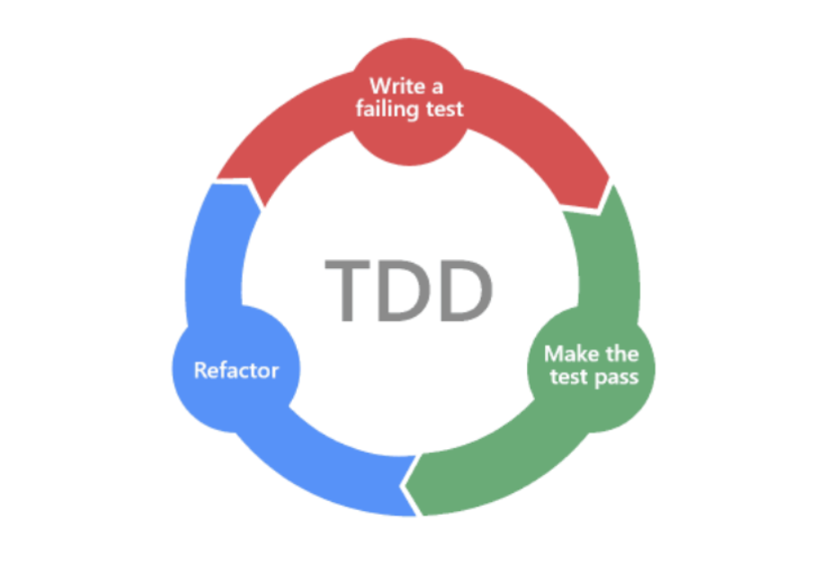

## 학습 키워드
- TDD 란
    - TDD Cycle

## TDD (Test Driven Development)
* 정의
작은 단위의 테스트 케이스를 작성하고 이를 통과하는 코드를 추가하는 과정을 반복(TDD Cycle)하여 목표하는 코드를 작성하는 개발 방법론

## TDD Cycle

1. Red : 실패하는 테스트 코드를 작성
2. Green : 최대한 빨리 테스트를 통과시킴
3. Blue : 리펙터링

* 왜 사용하는가?
디버깅 시간의 단축, 높은 코드 안정성, 재설계 시간의 단축

* 단점
생산성 저하

* 좋은 TDD의 규칙
    * Fast하여 빠르게 반복할 수 있어야한다.
    * Independent하여 각각의 테스트는 독립적이어야한다.
    * Repeatable 어느 환경(네트워크, 데이터베이스에 의존 x)에서도 반복 가능해야 한다.
    * Self-Validating 성공 또는 실패로 boolean값으로 결과를 내어 자체 검증 (자동화가 되어야함) -- 이건 무슨말인지 이해안됨
    * Timely 테스트하려는 실제 코드를 구현하기 직전에 구현해야 한다.