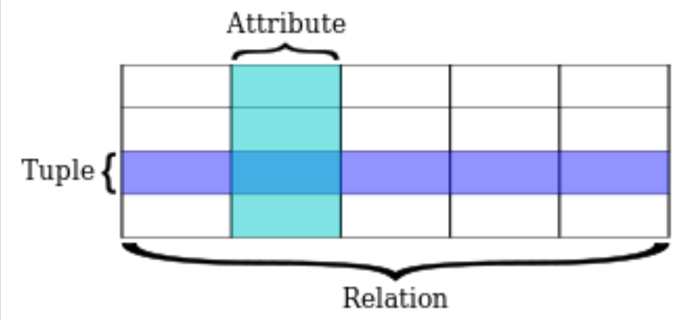

## 학습 키워드
- 관계 데이터 모델 용어 정리
    - 속성
    - 튜플
    - 관계

## 관계 데이터 모델 용어 정리
    * 속성 (Attribute)
        * 정의: 엔터티가 가지고 있는 성질이나 특징
        * 구조: 이름-타입
        * 조건: 이름은 집합에서 유일해야함

    * 튜플 (Tuple)
        * 정의: 속성과 속성값의 집합
        * 구조: 속성-값
        * 특징: 기본적으로 튜플은 집합이므로 중복을 허용x -> RDBMS는 중복 허용
    
    * 관계 (Relation)
        * 정의:
        * 구조: (속성의 집합, 튜플의 집합) 의 쌍
           
        * 참고: heading -> 속성의 집합, body -> 튜플의 집합
        * database에서 Table로 구현