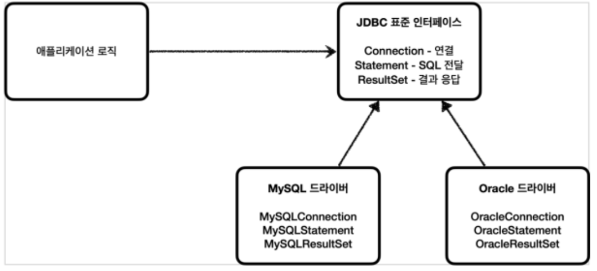

## 학습 키워드
- V 모델
- Test Matrix
- 내적 품질(테스트 코드 작성등)을 높이면 좋은 이유
- JUnit
- 단위 테스트
- E2E 테스트

## V 모델
1. 요구사항 분석 (사용자 중심) -> 인수 테스트
2. 시스템 설계 (시스템 사양 결정) -> 시스템 테스트
3. 아키텍처 설계 (고수준 설계) -> 통합 테스트
4. 모듈 설계 (저수준 설계) -> 단위 테스트
5. 구현 -> 코딩

* vs 폭포수 모델

## Test Matrix
* 내적 품질   
코드 품질, 즉 소스 코드의 구조적인(structural) 품질. 클린 코드가 이에 대한것
* 외적 품질   
: 기능적인(functional) 품질로서, 소프트웨어가 기대되는 동작을 하는지

## 내적 품질(테스트 코드 작성등)을 높이면 좋은 이유

## JUnit (Unit Test)
* 자동화된 테스트를 지원하는 도구. 단위 테스트 뿐 아니라, 통합테스트-E2E테스트를 작성하는데도 사용

## 단위 테스트   
하나의 모듈을 기준으로 독립적으로 진행되는 가장 작은 단위의 테스트

## E2D(End-To-End) 테스트란?   
애플리케이션의 기능을 처음부터 끝까지 테스트 하고, 성능 수준을 테스트 하는 것.

## SUT (System Under Test)
테스트 대상 시스템, 테스트를 하려는 대상.

** 유의 할것 **
   
우리는 Unit Test를 많이 해야 신뢰성 있는 시스템을 만들 수 있다.