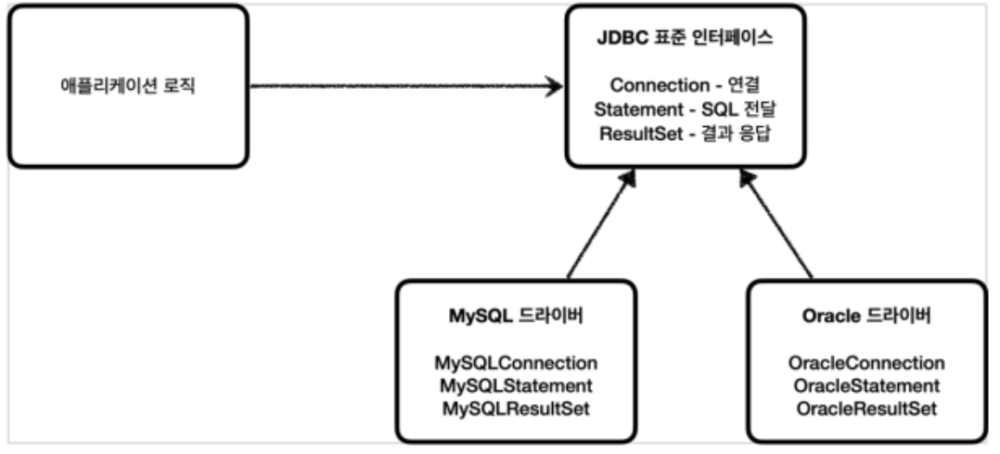

## 학습 키워드
- JDBC(Java Database Connectivity)

## JDBC (Java Database Connectivity)
* 정의 : Java에서 RDBMS를 사용할 수 있게 해주는 API   
-> 실제로 사용하기 위해서는 JDBC Driver가 필요!   

   

* JDBC Driver   
사용하고자 하는 JDBC 드라이버 로딩 --> DriverManager 클래스를 통해 로딩

* Connection 객체   
DriverManager를 통해 데이터베이스와 연결되는 세션(Session)인 Connection 객체를 생성

* Statement 객체   
Statement 객체는 작성된 SQL 쿼리문을 실행하기 위한 객체

* ResultSet 객체
Statement를 이용하여 ResultSet을 얻음

## Spring JdbcTemplate
* 정의   
앞서 Driver 로딩 ~ Statement 객체 생성 해주는 과정들을 생략해주고, 쿼리만 작성하면 되게끔 도와주는 API

* 내부 과정   
Connection 획득 ~ Statement 준비 실행 -> 루프 실행 -> Connection / Statement 종료 -> Connection 동기화