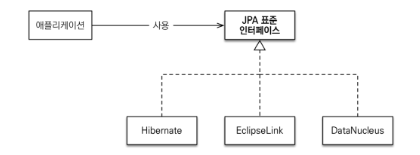
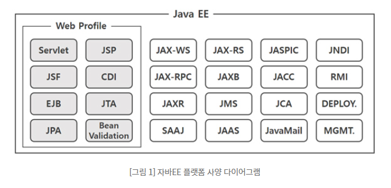

## 학습 키워드
- ORM
- JPA(Jakarta Persistence API)
- Jakarta EE

## 영속성(Persistence)
* 정의 : 데이터를 생성한 프로그램이 종료되더라도 사라지지 않는 데이터의 특성
* Object Persistence (영구적인 객체)
    * 메모리 상의 데이터를 파일 시스템, 관계형 테이터베이스 혹은 객체 데이터베이스 등을 활용하여 영구적으로 저장하여 영속성 부여함

* 데이터를 데이터베이스에 저장하는 3가지 방법
    * JDBC (java에서 사용)
    * Spring JDBC (Ex. JdbcTemplate)
    * Persistence Framework (Ex. Hibernate, Mybatis 등)

* Persistence Layer   
프로그램의 아키텍처에서, 데이터에 영속성을 부여해주는 계층.   
주로 Persistence framework를 이용하여 개발.

* Persistence Framework   
JDBC 프로그래밍의 복잡함이나 번거로움 없이 간단한 작업만으로 데이터베이스와 연동되는 시스템을 빠르게 개발할 수 있으며 안정적인 구동을 보장.   
   
    * SQL Mapper
    * ORM : JPA, Hibernate, Mybatis 등   

## ORM (Object-Relational-Mapping)
* 정의 : 객체(클래스)와 관계형 데이터(테이블)를 맵핑하는 기술 
* 기능
    * 객체와 테이블 맵핑
    * 객체의 생명주기를 관리
    * SQL문을 자동으로 생성
    * SELECT 후 객체를 생성하거나, 객체의 상태를 활용해 UPDATE를 하거나 하는 작업을 수행
* 장점
    * 직관적이고 비즈니스 로직에 집중 할 수 있음 (SQL Query가 아닌 메서드로 데이터 조작 가능 -> 객체 모델로 프로그래밍 하는데 집중 가능)
    * 재사용 및 유지보수 편리성 증가 (ORM은 독립적이며 객체들을 재활용할 수 있음)
    * DBMS에 대한 종속성이 줄어듬 
    

## JPA (Jakarta Persistence API)
* 정의 : 관계형 데이터 관리 API. Java에서 사용하는 ORM 표준
* 단점
    * JPA 인터페이스를 구현한 대표적인 오픈소스가 Hibernate   
       

## Jakarta EE
 * J2EE란?   
 분산 애플리케이션 개발 목적의 표준 플랫폼 (서블릿, JSP 등을 포함)   
    
 * Java -> Jakarta   
 스프링 프레임워크 등 오픈소스의 등장으로 인해 인기 하락 -> 이클립스 재단에 자바EE 이관