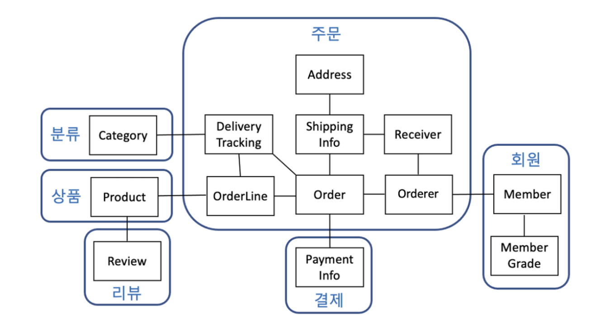

## 학습 키워드
- Hibernate
- 데이터 모델 / 객체 모델
- entityManager
- 트랜잭션
- JPQL

## Hibernate
* 정의 : 대표적인 JPA 구현체 (ORM) 으로, 자바언어 기반의 객체 관계 매핑 프레임워크
* 장점 : SQL을 사용하지 않고 직관적인 코드를 사용해 데이터 조작 가능
* 특징
    * Hibernate가 지원하는 메소드 내부에서 JDBC API가 동작
    * JPA와 Hibernate는 마치 Interface와 Class의 관계
       

## 객체 모델
* 정의 : 객체 지향 프로그래밍 관점에서 모델링 한 것. 각 객체는 상태(속성), 행동(메서드)를 가지며, 각 객체간의 상호 작용을 통해 시스템 동작

* 장점 : 모듈화와 유지보수, 재사용, 유연성
* 단점 : 처리 속도가 느려질 수 있음

## 데이터 모델
* 정의 : 데이터베이스 및 데이터 관리 시스템에서 데이터의 구조, 관계, 제약조건을 나타내는 모델. 엔티티, 속성, 관계 등을 사용해 DB구조 기술하며 쿼리를 기반으로 시스템 동작

* 장정 : 데이터 구조의 명확성, 무결성
* 단점 : 언어의 복잡성

## JPA Entity
* 정의 : 영속성을 가진 객체로, db 테이블에 보관할 대상
* JPA Entity Life Cycle 이란?
 

## entityManager
* 정의 : 엔터티를 저장하는 메모리상의 데이터베이스
* 특징 
    * entityManager는 엔터티를 저장, 수정, 삭제, 조회 에 대한 모든일을 함
    * Thread-Safe하지 않음 -> 동시성 문제가 발생할 수 있음 -> 엔티티 매니저는 스레드간에 공유 절대 금지! (EntityManagerFactory는 괜찮)

## 트랜잭션
* 정의 : 데이터베이스의 상태를 변화시키기 해서 수행하는 작업의 단위
* 연산 : COMMIT, ROLLBACK
* 특징 : ACIT
    * Atomicity (원자성) : 트랜잭션이 db에 모두 반영되거나, 전혀 반영되지 않아야 함
    * Consistency (일관성) : 처리 결과가 항상 일관성이 있어야함
    * Isolation (독립성) : 둘 이상의 트랜잭션이 동시에 실행시, 다른 트랜잭션의 연산에 끼어들수 없음
    * Durability (지속성) : 트랜잭션이 성공적으로 완료됐을 경우, 결과는 영구적으로 반영되어야 함

## JPQL (Java Persistence Query Language)
* 정의 : 엔터티 객체를 조회하는 객체지향 쿼리 (테이블 대상으로 쿼리하는 것이 아닌, 엔터티 객체를 대상으로 쿼리)
* 예시   

        String jpql = "select m from Member as m where m.name = 'coco'";

* SQL과 차이점
    * 엔터티와 속성은 대소문자를 구분